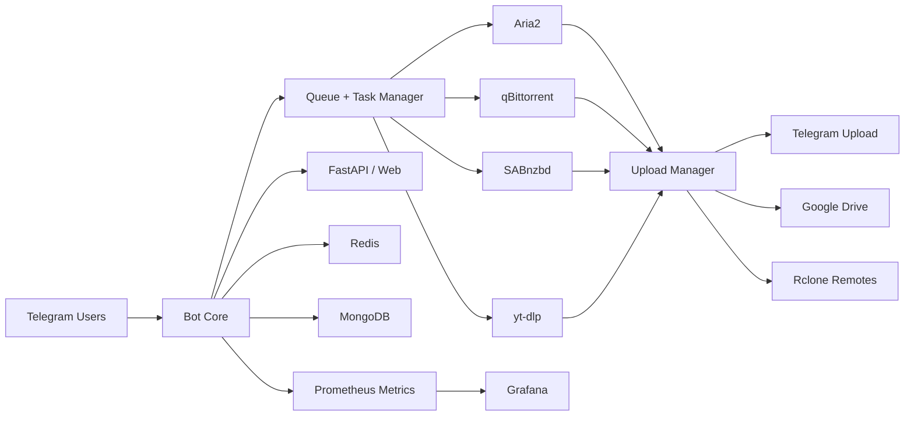

<div align="center">

# Mirror Leech Telegram Bot

Production-grade Telegram bot for mirroring, leeching, cloud uploads, and automated operations.

[](https://www.python.org/)
[](pyproject.toml)
[](deployment/compose/docker-compose.yml)
[](docs/guides/INSTALLATION.md)
[](https://telegram.org/)
[](docs/api/API_REFERENCE.md)
[](deployment/compose/docker-compose.yml)
[](deployment/compose/docker-compose.yml)
[](deployment/compose/docker-compose.yml)
[](clients/aria2/)
[](clients/qbittorrent/)
[](clients/sabnzbd/)
[](config/requirements.txt)
[](src/bot/)
[](integrations/rclone/)
[](integrations/monitoring/)
[](integrations/monitoring/)
[](deployment/otel-collector-config.yml)
[](pyproject.toml)
[](docs/LICENSE)

[Overview](#overview) • [Features](#features) • [Architecture](#architecture) • [Quick-Start](#quick-start) • [Configuration](#configuration) • [Deployment](#deployment) • [Documentation](#documentation) • [Security](#security)

**🆕 Code Quality Initiative**: Check out our [10-week improvement roadmap](docs/SUMMARY.md) with GitHub Copilot integration!

</div>

---

## Overview

Mirror Leech Telegram Bot is a full-stack Telegram automation platform built for large-file workflows. It combines multi-source downloading, cloud destination uploads, queueing, API access, monitoring, and operational tooling in one repository.

### Primary use cases

- Mirror files/links to cloud remotes.
- Leech files directly to Telegram.
- Run resilient download/upload pipelines with retries, queue priorities, and scheduled jobs.
- Operate in production with metrics, health checks, backup scripts, and hardened Docker profiles.

---

## Features

### Download and transfer capabilities

- HTTP/HTTPS direct links
- BitTorrent and magnet workflows via Aria2 and qBittorrent
- NZB pipelines via SABnzbd integration
- Video/media ingestion via `yt-dlp`
- Google Drive and remote storage transfer paths
- Telegram upload with large-file handling and splitting support

### Reliability and automation

- Priority queueing with async task orchestration
- Smart retry and failure-handling patterns
- Optional circuit-breaker and recovery modules
- Background worker execution with Celery
- Automated operational scripts for health, cleanup, and backups

### Operations and observability

- FastAPI endpoints and web routes
- Prometheus metrics export
- Grafana-compatible dashboards
- OpenTelemetry collector integration
- Structured logging and runtime diagnostics

---

## Architecture



---

## Quick Start

### 1) Clone repository

```bash
git clone https://github.com/adirane45/mirror-leech-telegram-bot.git
cd mirror-leech-telegram-bot
```

### 2) Prepare environment file

```bash
cp config/.env.example config/.env.production
```

Update required values in `config/.env.production`:

```env
BOT_TOKEN=...
TELEGRAM_API=...
TELEGRAM_HASH=...
OWNER_ID=...
```

### 3) Start with Docker Compose

```bash
docker compose up -d
docker compose ps
docker compose logs -f app
```

### 4) Validate service endpoints

- App/API: `http://localhost:8060`
- API docs: `http://localhost:8060/docs`
- Health: `http://localhost:8060/health`
- Prometheus: `http://localhost:9091`
- Grafana: `http://localhost:3000`

---

## Configuration

Core configuration is managed through environment files and `config/main_config.py`.

### Required variables

| Variable | Purpose |
|---|---|
| `BOT_TOKEN` | Telegram bot token from BotFather |
| `TELEGRAM_API` | Telegram API ID |
| `TELEGRAM_HASH` | Telegram API hash |
| `OWNER_ID` | Telegram user ID for bot owner/admin |

### Common infrastructure variables

| Variable | Typical value |
|---|---|
| `REDIS_HOST` | `redis` |
| `REDIS_PORT` | `6379` |
| `ARIA2_HOST` | `aria2` |
| `ARIA2_PORT` | `6800` |
| `QB_HOST` | `qbittorrent` |
| `QB_PORT` | `8090` |
| `BASE_URL_PORT` | `8060` |

Complete reference: [Configuration Guide](docs/guides/CONFIGURATION.md)

---

## Bot Commands

| Command | Description |
|---|---|
| `/start` | Initialize bot session |
| `/help` | Show command help |
| `/mirror <url>` | Download and mirror to cloud destination |
| `/leech <url>` | Download and upload to Telegram |
| `/ytdl <url>` | Fetch media through yt-dlp workflow |
| `/status` | View active tasks and progress |
| `/cancel` | Cancel active task(s) |

Extended/admin references: [Commands Guide](docs/guides/COMMANDS.md)

---

## Deployment

### Compose profiles in this repository

- `deployment/compose/docker-compose.yml` (default stack)
- `deployment/compose/docker-compose.optimized.yml` (optimized image/runtime profile)
- `deployment/compose/docker-compose.secure.yml` (security-focused profile)
- `deployment/compose/docker-compose.bluegreen.yml` (blue/green deployment strategy)

### Kubernetes support

Base manifests are available in `kubernetes/` including deployment, namespace, and kustomization resources.

### Manual Python runtime

```bash
python3 -m venv venv
source venv/bin/activate
pip install -r requirements/prod.txt
PYTHONPATH=$PWD:$PWD/src python -m bot
```

---

## Project Layout

```text
src/bot/                 Core bot runtime, modules, and helpers
config/                  Runtime configuration and requirements
deployment/              Dockerfiles, compose assets, telemetry config
integrations/            Monitoring, remote clients, third-party adapters
docs/                    User, operations, API, and runbook documentation
scripts/                 Setup, deployment, security, health, backup scripts
tests/                   Automated test suite
kubernetes/              K8s manifests and external-secret setup
```

---

## Documentation

- Main index: [docs/README.md](docs/README.md)
- Installation: [docs/guides/INSTALLATION.md](docs/guides/INSTALLATION.md)
- Configuration: [docs/guides/CONFIGURATION.md](docs/guides/CONFIGURATION.md)
- Commands: [docs/guides/COMMANDS.md](docs/guides/COMMANDS.md)
- API reference: [docs/api/API_REFERENCE.md](docs/api/API_REFERENCE.md)
- Production deployment: [docs/operations/PRODUCTION_DEPLOYMENT_GUIDE.md](docs/operations/PRODUCTION_DEPLOYMENT_GUIDE.md)
- Monitoring: [docs/operations/MONITORING.md](docs/operations/MONITORING.md)

---

## Development and Testing

```bash
pip install -r requirements-dev.txt
pytest -q
```

Python tooling settings are defined in `pyproject.toml` (`black`, `isort`, `mypy`, `pytest`).

---

## Security

- Security policy: [docs/SECURITY.md](docs/SECURITY.md)
- Secrets guidance: [docs/project/SECRETS_MANAGEMENT.md](docs/project/SECRETS_MANAGEMENT.md)
- Security hardening scripts: `scripts/security_hardening.sh`, `scripts/security_setup.py`

For vulnerability reports, follow the private reporting flow in `docs/SECURITY.md`.

---

## Contributing

- Contribution guidelines: [docs/CONTRIBUTING.md](docs/CONTRIBUTING.md)
- Code of conduct: [docs/CODE_OF_CONDUCT.md](docs/CODE_OF_CONDUCT.md)
- Change history: [docs/project/CHANGELOG.md](docs/project/CHANGELOG.md)

---

## Project Structure

This project follows a professional structure with clear separation of concerns:

- **`/src/`** - Application source code (bot, web, api)
- **`/tests/`** - Organized test suites (unit, integration, performance, tools)
- **`/docs/`** - Comprehensive documentation (guides, operations, development, runbooks)
- **`/deployment/`** - Docker and deployment configurations
- **`/scripts/`** - Automation and utility scripts
- **`/config/`** - Configuration files
- **`/integrations/`** - Third-party service integrations

See [docs/PROJECT_STRUCTURE.md](docs/PROJECT_STRUCTURE.md) for detailed directory layout.

---

## License

This project is distributed under GPL v3. See [docs/LICENSE](docs/LICENSE) for full text.
