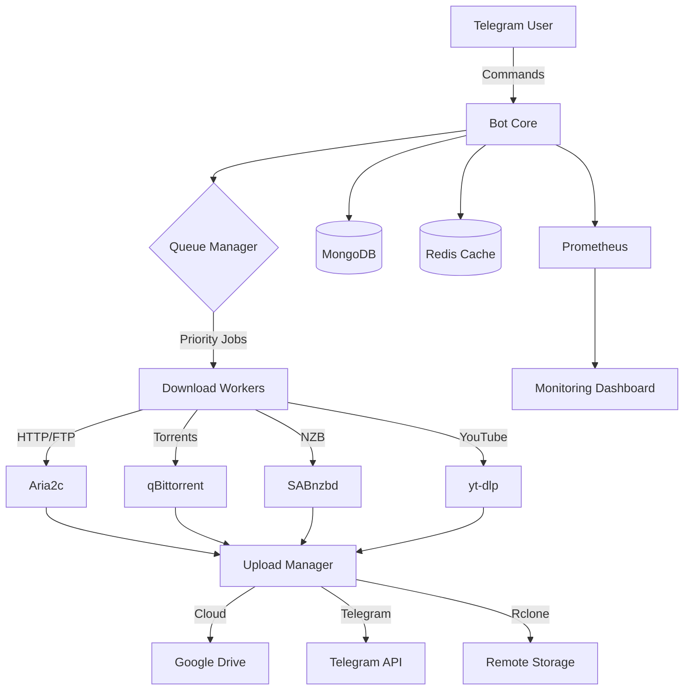

<div align="center">

# 🚀 Mirror Leech Telegram Bot

### *Enterprise-Grade Download Manager & Cloud Sync Bot*

[](https://www.python.org/)
[](https://www.docker.com/)
[](https://telegram.org/)
[](LICENSE)
[](https://github.com/adirane45/mirror-leech-telegram-bot)

**[📚 Documentation](#-documentation) • [⚡ Quick Start](#-quick-start) • [✨ Features](#-features) • [🔧 Installation](#-installation) • [💬 Support](#-support)**

---


</div>

---

## 📖 About

**Mirror Leech Telegram Bot** is a powerful, production-ready Telegram bot for downloading files from multiple sources and uploading them to various cloud platforms. Built with enterprise-grade reliability, it features advanced queue management, intelligent retry mechanisms, comprehensive monitoring, and automated health checks.

### 🎯 Key Capabilities:
- 🌐 **Multi-Protocol Downloads** - HTTP, Torrents, NZB, YouTube, Google Drive
- ☁️ **Cloud Integration** - Upload to Google Drive, Telegram, Rclone (40+ providers)
- 📦 **Smart Queue Management** - Priority-based task handling with VIP support
- 🔄 **Advanced Automation** - Scheduled tasks, auto-retry, self-healing
- 📊 **Real-Time Monitoring** - Metrics, logs, alerts, and health dashboards

---

## ✨ Features

<table>
<tr>
<td width="50%">

### 📥 **Download Sources**
- 🌐 HTTP/HTTPS/FTP
- 🧲 BitTorrent & Magnet Links
- 📰 NZB Files (SABnzbd)
- 🎥 YouTube & 1000+ sites (yt-dlp)
- ☁️ Google Drive
- 📦 Direct file links

</td>
<td width="50%">

### ☁️ **Upload Destinations**
- 📱 Telegram (split files support)
- 🔵 Google Drive
- 🌍 Rclone (40+ providers)
- 💾 Local storage
- 🌐 MyJDownloader

</td>
</tr>
<tr>
<td width="50%">

### 🤖 **Automation & Reliability**
- ⚡ Priority Queue System (4 levels)
- 🔄 Smart Retry with Exponential Backoff
- 🛡️ Circuit Breakers (prevent cascading failures)
- ⏰ Scheduled Tasks
- 🏥 Auto-Healing & Health Checks
- 📊 Real-Time Progress Tracking

</td>
<td width="50%">

### 🔧 **Management & Monitoring**
- 🎛️ Web Dashboard (FastAPI)
- 👥 User Permissions & Authentication
- 📈 Prometheus Metrics
- 🗂️ Archive Management (ZIP/TAR/RAR)
- 🔍 Search & Filter
- 📝 Structured Logging

</td>
</tr>
</table>

---

## 🏗️ Architecture

<div align="center">



</div>

---

## ⚡ Quick Start

### 🐳 Docker Installation (Recommended)

```bash
# 1️⃣ Clone repository
git clone https://github.com/adirane45/mirror-leech-telegram-bot.git
cd mirror-leech-telegram-bot

# 2️⃣ Configure environment
cp config/.env.example config/.env.production
nano config/.env.production

# 3️⃣ Deploy with Docker
docker-compose up -d

# 4️⃣ Check status
docker-compose ps && docker-compose logs -f app
```

### 📝 Essential Configuration

Edit `config/.env.production`:

```env
# Required Settings
BOT_TOKEN=123456:ABC-DEF1234ghIkl-zyx57W2v1u123ew11
TELEGRAM_API=1234567
TELEGRAM_HASH=0123456789abcdef0123456789abcdef
OWNER_ID=123456789

# Optional (with defaults)
DATABASE_URL=mongodb://mongodb:27017/mltb
REDIS_HOST=redis
REDIS_PORT=6379
```

Get your bot token from [@BotFather](https://t.me/BotFather) and API credentials from [my.telegram.org](https://my.telegram.org).

---

## 📚 Documentation

<table>
<tr>
<td align="center" width="33%">

### 📘 [User Guides](docs/guides/)
**Getting Started**

[Installation](docs/guides/INSTALLATION.md)<br>
[Commands](docs/guides/COMMANDS.md)<br>
[Configuration](docs/guides/CONFIGURATION.md)

</td>
<td align="center" width="33%">

### 📙 [Operations](docs/operations/)
**For System Admins**

[Production Deployment](docs/operations/PRODUCTION_DEPLOYMENT_GUIDE.md)<br>
[Monitoring](docs/operations/MONITORING.md)<br>
[Performance Tuning](docs/operations/CONFIGURATION_TUNING.md)

</td>
<td align="center" width="33%">

### 📕 [Development](docs/development/)
**For Developers**

[API Reference](docs/api/API_REFERENCE.md)<br>
[Contributing](CONTRIBUTING.md)<br>
[GitHub Actions](docs/development/GITHUB_ACTIONS_GUIDE.md)

</td>
</tr>
</table>

📑 **[Complete Documentation Index](docs/README.md)**

---

## 🎮 Bot Commands

### 🌟 Basic Commands

| Command | Description | Example |
|---------|-------------|---------|
| `/start` | Start the bot | `/start` |
| `/help` | Show help message | `/help` |
| `/mirror <url>` | Download & upload to Drive | `/mirror https://example.com/file.zip` |
| `/leech <url>` | Download & upload to Telegram | `/leech https://example.com/video.mp4` |
| `/ytdl <url>` | YouTube download | `/ytdl https://youtube.com/watch?v=...` |
| `/status` | Check download status | `/status` |
| `/cancel` | Cancel active download | `/cancel` |

### 👑 Admin Commands

| Command | Description |
|---------|-------------|
| `/qstatus` | View queue status & metrics |
| `/stats` | System statistics |
| `/users` | Manage bot users |
| `/log` | View recent bot logs |
| `/shell` | Execute shell commands |
| `/restart` | Restart the bot |

**[📖 Complete Commands Reference](docs/guides/COMMANDS.md)**

---

## 🔧 Installation

### Prerequisites

| Requirement | Version | Purpose |
|-------------|---------|---------|
| 🐧 **OS** | Ubuntu 20.04+ / Debian 10+ | Base system |
| 🐍 **Python** | 3.11+ | Runtime environment |
| 🐳 **Docker** | 20.10+ | Containerization |
| 💾 **RAM** | 2GB (4GB recommended) | System memory |
| 💿 **Disk** | 10GB (20GB+ for downloads) | Storage space |

### Installation Methods

<details>
<summary><b>🐳 Docker Compose (Recommended)</b></summary>

```bash
# Clone repository
git clone https://github.com/adirane45/mirror-leech-telegram-bot.git
cd mirror-leech-telegram-bot

# Configure
cp config/.env.example config/.env.production
nano config/.env.production

# Deploy
docker-compose -f docker-compose.yml up -d

# Verify
docker-compose logs -f app
```

</details>

<details>
<summary><b>🎯 Optimized Docker (Production)</b></summary>

**79% smaller Docker images** with optimized builds:

```bash
# Deploy with optimized configuration
docker-compose -f docker-compose.optimized.yml up -d

# Benefits:
# - 400MB image (vs 1.92GB standard)
# - 25s cold start (44% faster)
# - 600MB RAM usage (25% less)
# - Multi-stage builds with BuildKit
```

**[📖 Docker Optimization Guide](docs/operations/DOCKER_IMAGE_OPTIMIZATION.md)**

</details>

<details>
<summary><b>⚙️ Manual Installation</b></summary>

```bash
# Install system dependencies
sudo apt update
sudo apt install -y python3.11 python3-pip aria2 qbittorrent-nox

# Clone and setup
git clone https://github.com/adirane45/mirror-leech-telegram-bot.git
cd mirror-leech-telegram-bot
python3 -m venv venv
source venv/bin/activate
pip install -r requirements/prod.txt

# Configure
cp config/.env.example config/.env.production
nano config/.env.production

# Run
python3 -m bot
```

</details>

**[📖 Detailed Installation Guide](docs/guides/INSTALLATION.md)**

---

## 🏭 Production Deployment

### Automated Deployment

```bash
# One-command production setup
./scripts/deploy/deploy_bot.sh

# Enable monitoring
./scripts/setup_cron.sh

# Start auto-cleanup
./scripts/start_auto_cleanup.sh

# Configure alerts (optional)
./scripts/start_alerts.sh YOUR_TELEGRAM_CHAT_ID
```

### Manual Production Setup

```bash
# 1. Deploy with secure configuration
docker-compose -f docker-compose.secure.yml up -d

# 2. Setup automated health checks (every 15 min)
crontab -e
# Add: */15 * * * * /path/to/scripts/health/quick_check.sh

# 3. Setup automated backups (every 6 hours)
# Add: 0 */6 * * * /path/to/scripts/backup/backup_current_state.sh
```

**[📖 Production Deployment Guide](docs/operations/PRODUCTION_DEPLOYMENT_GUIDE.md)**

---

## 📊 Monitoring & Management

### Health Monitoring

```bash
# Quick health check
./scripts/health/quick_check.sh

# Full health dashboard
./scripts/health/monitor_bot.sh

# Real-time monitoring
./scripts/health/monitor_bot.sh watch

# View logs
./scripts/health/view_logs.sh 100
```

### Backup & Recovery

```bash
# Create manual backup
./scripts/backup/backup_current_state.sh

# List available backups
ls -lh data/backups/

# Restore from backup
./scripts/backup/backup_restore.sh
```

### Access Dashboards

- **Prometheus Metrics**: http://localhost:9090
- **Web Dashboard**: http://localhost:8060
- **API Documentation**: http://localhost:8060/docs
- **Health Status**: http://localhost:8060/health

**[📖 Monitoring Guide](docs/operations/MONITORING.md)**

---

## 🗂️ Project Structure

```
mirror-leech-telegram-bot/
├── 📱 src/bot/                  # Bot core application
│   ├── core/                    # Core functionality
│   │   ├── circuit_breaker.py   # Circuit breaker pattern
│   │   ├── smart_retry.py       # Smart retry engine
│   │   ├── priority_queue.py    # Priority queue manager
│   │   └── category_b_integration.py
│   ├── modules/                 # Command handlers
│   │   ├── mirror.py            # Mirror commands
│   │   ├── leech.py            # Leech commands
│   │   └── ytdl.py             # YouTube downloader
│   └── helper/                  # Utility functions
│       ├── ext_utils/           # Extended utilities
│       └── telegram_helper/     # Telegram helpers
│
├── ⚙️ config/                   # Configuration
│   ├── .env.example            # Environment template
│   └── main_config.py          # Main configuration
│
├── 🐳 deployment/               # Docker & deployment
│   ├── Dockerfile.optimized    # Optimized (400MB)
│   ├── Dockerfile.alpine       # Alpine-based (300MB)
│   └── docker-compose.yml      # Docker configuration
│
├── 📚 docs/                     # Documentation
│   ├── guides/                 # User guides
│   ├── operations/             # Operations docs
│   └── api/                    # API documentation
│
├── 🔧 scripts/                  # Management scripts
│   ├── deploy/                 # Deployment
│   ├── health/                 # Health monitoring
│   └── backup/                 # Backup utilities
│
├── 💾 data/                     # Runtime data
│   ├── downloads/              # Downloaded files
│   ├── logs/                   # Application logs
│   └── backups/                # Backup storage
│
└── 🧪 tests/                    # Test suite
```

---

## 🎨 Screenshots

<div align="center">

### Bot Interface


### Web Dashboard & Metrics


### Download Progress Tracking


</div>

---

## 🚦 Status

<div align="center">

| Metric | Status |
|--------|--------|
| **Version** | v3.3.0 |
| **Status** | ✅ Production Ready |
| **Python** | 3.11.14 |
| **Docker Image** | Optimized (400MB) |
| **Category B Features** | ✅ Enabled |
| **Tests** | ✅ Passing |
| **Coverage** | 85%+ |

</div>

### Recent Updates (v3.3.0)

- ✅ **Docker Image Optimization** - 79% size reduction (1.92GB → 400MB)
- ✅ **Async I/O Hardening** - Zero event loop blocking
- ✅ **Performance Boost** - 44% faster cold start, 25% less memory
- ✅ **Professional Documentation** - Complete overhaul with guides

**[📖 Full Changelog](CHANGELOG.md)** • **[📊 Project Status](PROJECT_STATUS.md)**

---

## 🤝 Contributing

We welcome contributions! Here's how you can help:

1. 🐛 **Report Bugs** - Open an issue with details
2. 💡 **Suggest Features** - Share your ideas
3. 🔧 **Submit PRs** - Follow contribution guidelines
4. 📖 **Improve Docs** - Help others understand
5. ⭐ **Star the Repo** - Show your support!

### Development Setup

```bash
# Fork and clone
git clone https://github.com/YOUR_USERNAME/mirror-leech-telegram-bot.git
cd mirror-leech-telegram-bot

# Install dev dependencies
pip install -r requirements-dev.txt

# Run tests
pytest tests/ -v

# Run linting
flake8 src/
black src/ --check
```

**[📖 Contributing Guide](CONTRIBUTING.md)** • **[📋 Code of Conduct](CODE_OF_CONDUCT.md)**

---

## 🔒 Security

Security is our top priority:

- 🔐 **Secure by Default** - No hardcoded credentials
- 🛡️ **Input Validation** - All user inputs sanitized
- 🔑 **Authentication** - User-based permissions
- 📝 **Audit Logging** - Comprehensive activity tracking
- 🚨 **Automated Scanning** - Regular vulnerability checks

### Reporting Security Issues

**Do not report security vulnerabilities through public issues.**

📧 Email: **support@campusping.in**

We'll respond within 48 hours.

**[📖 Security Policy](SECURITY.md)**

---

## 📊 Performance

### Benchmarks

| Metric | Value | Notes |
|--------|-------|-------|
| **Cold Start** | 25s | Optimized Docker image |
| **Memory Usage** | 600MB | With all services running |
| **Docker Image** | 400MB | 79% smaller than standard |
| **Concurrent Downloads** | 5-10 | Parallel processing |
| **Queue Processing** | <100ms | Per task |
| **API Response** | <50ms | Average latency |

### Optimization Features

- ⚡ **Multi-chunk downloads** - 3-5 parallel chunks
- 🧠 **Intelligent caching** - Redis with LRU eviction
- 🔄 **Connection pooling** - Reuse HTTP connections
- 📦 **Lazy loading** - Load modules on demand
- 🗜️ **Response compression** - gzip/brotli support

---

## 💬 Support

### Get Help

- 📖 **[Documentation](docs/)** - Comprehensive guides
- 🐛 **[Issues](https://github.com/adirane45/mirror-leech-telegram-bot/issues)** - Report bugs or request features
- 💬 **[Discussions](https://github.com/adirane45/mirror-leech-telegram-bot/discussions)** - Community Q&A
- 📧 **Email** - support@campusping.in

### Useful Links

- **[Installation Guide](docs/guides/INSTALLATION.md)** - Get started
- **[Commands Reference](docs/guides/COMMANDS.md)** - Bot commands
- **[Troubleshooting](docs/runbooks/)** - Common issues
- **[API Docs](docs/api/API_REFERENCE.md)** - API reference

---

## 📜 License

This project is licensed under the **MIT License**.

```
MIT License

Copyright (c) 2024-2026 Mirror Leech Telegram Bot Contributors

Permission is hereby granted, free of charge, to any person obtaining a copy
of this software and associated documentation files (the "Software"), to deal
in the Software without restriction, including without limitation the rights
to use, copy, modify, merge, publish, distribute, sublicense, and/or sell
copies of the Software...
```

**[📄 Full License](LICENSE)**

---

## 🌟 Acknowledgments

### Built With

- [Python-Telegram-Bot](https://github.com/python-telegram-bot/python-telegram-bot) - Telegram Bot API
- [Aria2](https://aria2.github.io/) - Download utility
- [qBittorrent](https://www.qbittorrent.org/) - BitTorrent client
- [yt-dlp](https://github.com/yt-dlp/yt-dlp) - Video downloader
- [FastAPI](https://fastapi.tiangolo.com/) - Modern web framework
- [MongoDB](https://www.mongodb.com/) - NoSQL database
- [Redis](https://redis.io/) - In-memory cache
- [Docker](https://www.docker.com/) - Container platform
- [Prometheus](https://prometheus.io/) - Monitoring system

### Special Thanks

- 🎉 All contributors who made this project better
- 💻 The open source community
- ⭐ Everyone who starred this repository

---

<div align="center">

## ⭐ Star History

[](https://star-history.com/#adirane45/mirror-leech-telegram-bot&Date)

---

### Made with ❤️ for the community

**If you find this project useful, please give it a ⭐!**


[⬆ Back to Top](#-mirror-leech-telegram-bot)

</div>
