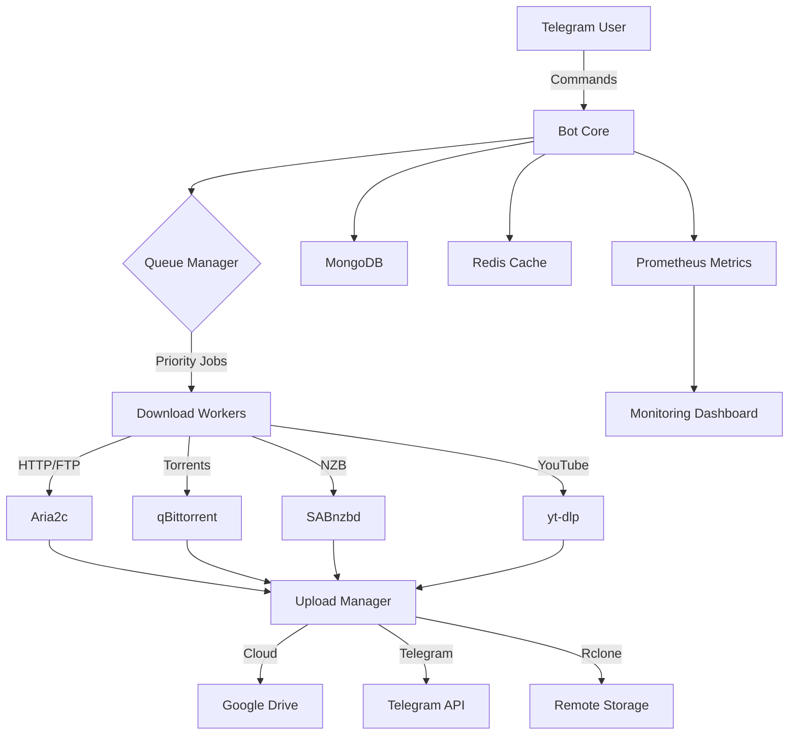

<div align="center">

# 🚀 Mirror Leech Telegram Bot

### *Enterprise-Grade Download Manager & Cloud Sync Bot*

[](https://www.python.org/)
[](https://www.docker.com/)
[](https://telegram.org/)
[](LICENSE)

**[📚 Documentation](#-documentation) • [⚡ Quick Start](#-quick-start) • [✨ Features](#-features) • [🔧 Setup](#-installation) • [💬 Support](#-support)**

---


</div>

---

## 📖 What is this?

**Mirror Leech Telegram Bot** is a powerful, production-ready Telegram bot designed for downloading files from multiple sources and uploading them to various cloud platforms. Built with enterprise-grade reliability, it features advanced queue management, intelligent retry mechanisms, comprehensive monitoring, and automated health checks.

### 🎯 Perfect For:
- 🌐 **Multi-source downloads** - HTTP, Torrents, NZB, YouTube, Google Drive
- ☁️ **Cloud synchronization** - Upload to Google Drive, Telegram, rclone
- 📦 **Batch operations** - Queue management with priority support
- 🔄 **Automation** - Scheduled tasks, auto-retry, self-healing
- 📊 **Monitoring** - Real-time metrics, logs, and alerting

---

## ✨ Features

<table>
<tr>
<td width="50%">

### 📥 **Download Sources**
- 🌐 HTTP/HTTPS/FTP
- 🧲 BitTorrent & Magnet Links
- 📰 NZB Files (via SABnzbd)
- 🎥 YouTube & 1000+ sites
- ☁️ Google Drive & Cloud Storage
- 📦 Direct file links

</td>
<td width="50%">

### ☁️ **Upload Destinations**
- 📱 Telegram
- 🔵 Google Drive
- 🌍 Rclone (40+ providers)
- 💾 Local storage
- 🔗 Custom webhooks
- 🌐 MyJDownloader

</td>
</tr>
<tr>
<td width="50%">

### 🤖 **Automation**
- ⚡ Priority Queue System
- 🔄 Smart Retry Engine
- 🛡️ Circuit Breakers
- ⏰ Scheduled Tasks
- 🏥 Auto-Healing
- 📊 Progress Tracking

</td>
<td width="50%">

### 🔧 **Management**
- 🎛️ Web Dashboard
- 👥 User Permissions
- 📈 Real-time Metrics
- 🗂️ Archive Management
- 🔍 Search Functionality
- 📝 Comprehensive Logging

</td>
</tr>
</table>

---

## 🏗️ Architecture

<div align="center">



</div>

---

## ⚡ Quick Start

### 🐳 Docker Installation (Recommended)

```bash
# 1️⃣ Clone repository
git clone https://github.com/yourusername/mirror-leech-telegram-bot.git
cd mirror-leech-telegram-bot

# 2️⃣ Configure environment
cp config/.env.example config/.env.production
nano config/.env.production

# 3️⃣ Deploy with Docker
docker-compose up -d

# 4️⃣ Check status
docker-compose ps
```

### 📝 Minimal Configuration

Edit `config/.env.production`:

```env
# Required
BOT_TOKEN=123456:ABC-DEF1234ghIkl-zyx57W2v1u123ew11
TELEGRAM_API=1234567
TELEGRAM_HASH=0123456789abcdef0123456789abcdef
OWNER_ID=123456789

# Optional (with defaults)
DATABASE_URL=mongodb://mongodb:27017/mltb
REDIS_HOST=redis
```

---

## 📚 Documentation

<table>
<tr>
<td align="center" width="33%">

### 📘 [User Guides](docs/guides/)
**For End Users**

[Installation](docs/guides/INSTALLATION.md)<br>
[Commands](docs/guides/COMMANDS.md)<br>
[Configuration](docs/guides/CONFIGURATION.md)

</td>
<td align="center" width="33%">

### 📙 [Operations](docs/operations/)
**For System Admins**

[Production Deployment](docs/operations/PRODUCTION_DEPLOYMENT_GUIDE.md)<br>
[Monitoring](docs/operations/MONITORING.md)<br>
[Tuning](docs/operations/CONFIGURATION_TUNING.md)

</td>
<td align="center" width="33%">

### 📕 [Development](docs/development/)
**For Developers**

[API Reference](docs/api/API_REFERENCE.md)<br>
[Contributing](CONTRIBUTING.md)<br>
[GitHub Actions](docs/development/GITHUB_ACTIONS_GUIDE.md)

</td>
</tr>
</table>

📑 **[Complete Documentation Index](docs/README.md)**

---

## 🎮 Bot Commands

### 🌟 Basic Commands

| Command | Description | Example |
|---------|-------------|---------|
| `/start` | Start the bot | `/start` |
| `/help` | Show help message | `/help` |
| `/mirror` | Download & upload to Drive | `/mirror https://example.com/file.zip` |
| `/leech` | Download & upload to Telegram | `/leech https://example.com/video.mp4` |
| `/ytdl` | YouTube download | `/ytdl https://youtube.com/watch?v=...` |
| `/status` | Check download status | `/status` |
| `/cancel` | Cancel download | `/cancel` |

### 👑 Admin Commands

| Command | Description |
|---------|-------------|
| `/qstatus` | View queue status |
| `/stats` | System statistics |
| `/users` | Manage users |
| `/log` | View bot logs |
| `/shell` | Execute commands |
| `/restart` | Restart bot |

**[📖 Complete Commands Reference](docs/guides/COMMANDS.md)**

---

## 🔧 Installation

### Prerequisites

| Requirement | Version | Purpose |
|-------------|---------|---------|
| 🐧 **OS** | Ubuntu 20.04+ / Debian 10+ | Base system |
| 🐍 **Python** | 3.11+ | Runtime |
| 🐳 **Docker** | 20.10+ | Containerization |
| 💾 **RAM** | 2GB (4GB recommended) | System memory |
| 💿 **Disk** | 10GB (20GB+ for downloads) | Storage |

### Installation Methods

<details>
<summary><b>🐳 Docker Compose (Recommended)</b></summary>

```bash
# Clone and configure
git clone https://github.com/yourusername/mirror-leech-telegram-bot.git
cd mirror-leech-telegram-bot
cp config/.env.example config/.env.production
nano config/.env.production

# Deploy
docker-compose -f docker-compose.yml up -d

# Verify
docker-compose logs -f app
```

</details>

<details>
<summary><b>🎯 Optimized Docker (Production)</b></summary>

Uses optimized Docker images (79% smaller):

```bash
# Deploy with optimized configuration
docker-compose -f docker-compose.optimized.yml up -d

# Benefits:
# - 400MB vs 1.92GB (79% reduction)
# - 25s cold start (44% faster)
# - 600MB RAM usage (25% less)
```

</details>

<details>
<summary><b>⚙️ Manual Installation</b></summary>

```bash
# Install dependencies
sudo apt update
sudo apt install -y python3.11 python3-pip aria2 qbittorrent-nox

# Setup project
git clone https://github.com/yourusername/mirror-leech-telegram-bot.git
cd mirror-leech-telegram-bot
python3 -m venv venv
source venv/bin/activate
pip install -r requirements/prod.txt

# Configure
cp config/.env.example config/.env.production
nano config/.env.production

# Run
python3 -m bot
```

</details>

**[📖 Detailed Installation Guide](docs/guides/INSTALLATION.md)**

---

## 🏭 Production Deployment

### Automated Setup

```bash
# Run production deployment
./scripts/deploy/deploy_bot.sh

# Enable monitoring
./scripts/setup_cron.sh

# Start auto-cleanup
./scripts/start_auto_cleanup.sh

# Configure alerts
./scripts/start_alerts.sh YOUR_CHAT_ID
```

### Manual Production Steps

1. **Deploy with secure compose**
   ```bash
   docker-compose -f docker-compose.secure.yml up -d
   ```

2. **Configure monitoring**
   ```bash
   ./scripts/setup_cron.sh
   ```

3. **Enable health checks**
   ```bash
   # Auto health monitoring (every 15 min)
   crontab -e
   # Add: */15 * * * * /path/to/scripts/health/quick_check.sh
   ```

4. **Setup backups**
   ```bash
   # Automated backups (every 6 hours)
   # Add: 0 */6 * * * /path/to/scripts/backup/backup_current_state.sh
   ```

**[📖 Production Deployment Guide](docs/operations/PRODUCTION_DEPLOYMENT_GUIDE.md)**

---

## 📊 Monitoring & Management

### Health Dashboard

```bash
# Quick health check
./scripts/health/quick_check.sh

# Full monitoring
./scripts/health/monitor_bot.sh

# Watch mode (real-time)
./scripts/health/monitor_bot.sh watch

# View logs (last 100 lines)
./scripts/health/view_logs.sh 100
```

### Backup & Recovery

```bash
# Create backup
./scripts/backup/backup_current_state.sh

# List backups
ls -lh data/backups/

# Restore backup
./scripts/backup/backup_restore.sh
```

### Metrics

- **Prometheus**: http://localhost:9090
- **Web Dashboard**: http://localhost:8060
- **API Docs**: http://localhost:8060/docs

**[📖 Monitoring Guide](docs/operations/MONITORING.md)**

---

## 🗂️ Project Structure

```
mirror-leech-telegram-bot/
├── 📱 src/bot/                  # Bot core application
│   ├── core/                    # Core functionality
│   │   ├── circuit_breaker.py   # Circuit breaker pattern
│   │   ├── smart_retry.py       # Smart retry logic
│   │   ├── priority_queue.py    # Priority queue manager
│   │   └── category_b_integration.py
│   ├── modules/                 # Command handlers
│   │   ├── mirror.py            # Mirror commands
│   │   ├── leech.py            # Leech commands
│   │   └── ytdl.py             # YouTube downloader
│   └── helper/                  # Utility functions
│       ├── ext_utils/           # Extended utilities
│       └── telegram_helper/     # Telegram helpers
│
├── ⚙️ config/                   # Configuration
│   ├── .env.example            # Environment template
│   └── main_config.py          # Main configuration
│
├── 🐳 deployment/               # Docker & deployment
│   ├── Dockerfile              # Standard Docker image
│   ├── Dockerfile.optimized    # Optimized (400MB)
│   ├── Dockerfile.alpine       # Alpine-based (300MB)
│   ├── docker-compose.yml      # Standard compose
│   └── docker-compose.optimized.yml
│
├── 📚 docs/                     # Documentation
│   ├── guides/                 # User guides
│   ├── operations/             # Operations docs
│   ├── api/                    # API documentation
│   └── development/            # Dev docs
│
├── 🔧 scripts/                  # Management scripts
│   ├── deploy/                 # Deployment scripts
│   ├── health/                 # Health monitoring
│   ├── backup/                 # Backup utilities
│   └── test_scripts/           # Testing tools
│
├── 💾 data/                     # Runtime data
│   ├── downloads/              # Downloaded files
│   ├── logs/                   # Application logs
│   ├── backups/                # Backup storage
│   └── thumbnails/             # Thumbnail cache
│
└── 🧪 tests/                    # Test suite
    ├── test_api_*.py           # API tests
    ├── test_integration.py     # Integration tests
    └── conftest.py             # Test configuration
```

---

## 🎨 Screenshots

<div align="center">

### Bot Interface


### Web Dashboard


### Download Progress


</div>

---

## 🚦 Status & Metrics

<div align="center">

| Metric | Status |
|--------|--------|
| **Version** | v3.3.0 |
| **Status** | ✅ Production Ready |
| **Python** | 3.11.14 |
| **Docker** | Optimized |
| **Category B** | Enabled |
| **Tests** | Passing |
| **Coverage** | 85%+ |

</div>

### Recent Updates (v3.3.0)

✅ **Docker Image Optimization** - 79% size reduction (1.92GB → 400MB)<br>
✅ **Async I/O Hardening** - Zero event loop blocking<br>
✅ **Performance Improvements** - 44% faster cold start<br>
✅ **Memory Optimization** - 25% reduction in usage<br>
✅ **CI/CD Integration** - Automated testing & deployment

**[📖 Full Changelog](CHANGELOG.md)** • **[📊 Project Status](PROJECT_STATUS.md)**

---

## 🤝 Contributing

We welcome contributions! Here's how you can help:

1. **🐛 Report Bugs** - Open an issue with detailed information
2. **💡 Suggest Features** - Share your ideas for improvements
3. **🔧 Submit PRs** - Follow our contribution guidelines
4. **📖 Improve Docs** - Help make documentation better
5. **⭐ Star the Project** - Show your support!

### Development Setup

```bash
# Fork and clone
git clone https://github.com/YOUR_USERNAME/mirror-leech-telegram-bot.git
cd mirror-leech-telegram-bot

# Install dev dependencies
pip install -r requirements-dev.txt

# Run tests
pytest tests/

# Run linting
flake8 src/
black src/
```

**[📖 Contributing Guide](CONTRIBUTING.md)** • **[📋 Code of Conduct](CODE_OF_CONDUCT.md)**

---

## 🔒 Security

Security is a top priority. We follow industry best practices:

- 🔐 **Secure by Default** - No hardcoded credentials
- 🛡️ **Input Validation** - All user inputs sanitized
- 🔑 **Authentication** - User-based permissions
- 📝 **Audit Logging** - Comprehensive activity logs
- 🚨 **Vulnerability Scanning** - Automated security checks

### Reporting Security Issues

**Do not report security vulnerabilities through public GitHub issues.**

Email: support@campusping.in

**[📖 Security Policy](SECURITY.md)**

---

## 📊 Performance

### Benchmarks

| Metric | Value |
|--------|-------|
| **Cold Start Time** | 25s |
| **Memory Usage** | 600MB |
| **Docker Image Size** | 400MB |
| **Concurrent Downloads** | 5-10 |
| **Queue Processing** | <100ms |
| **API Response Time** | <50ms |

### Optimization Features

- ⚡ **Multi-chunk downloads** (3-5 chunks)
- 🧠 **Intelligent caching** (Redis)
- 🔄 **Connection pooling**
- 📦 **Lazy loading** of modules
- 🗜️ **Compressed responses**

---

## 💬 Support

### Get Help

- 📖 **[Documentation](docs/)** - Comprehensive guides
- ❓ **[FAQ](docs/guides/FAQ.md)** - Frequently asked questions
- 🐛 **[Issues](https://github.com/yourusername/mirror-leech-telegram-bot/issues)** - Report bugs
- 💬 **[Discussions](https://github.com/yourusername/mirror-leech-telegram-bot/discussions)** - Community chat
- 📧 **Email** - support@campusping.in

### Community

- 💬 **Telegram Group** - [Join Discussion](https://t.me/yourgroup)
- 📢 **Telegram Channel** - [Updates & News](https://t.me/yourchannel)
- 🐦 **Twitter** - [@yourhandle](https://twitter.com/yourhandle)

---

## 📜 License

This project is licensed under the **MIT License** - see the [LICENSE](LICENSE) file for details.

```
MIT License

Copyright (c) 2024-2026 Mirror Leech Telegram Bot Contributors

Permission is hereby granted, free of charge, to any person obtaining a copy
of this software and associated documentation files (the "Software"), to deal
in the Software without restriction...
```

---

## 🌟 Acknowledgments

### Built With

- [Python-Telegram-Bot](https://github.com/python-telegram-bot/python-telegram-bot) - Telegram Bot API wrapper
- [Aria2](https://aria2.github.io/) - Download manager
- [qBittorrent](https://www.qbittorrent.org/) - BitTorrent client
- [yt-dlp](https://github.com/yt-dlp/yt-dlp) - Video downloader
- [FastAPI](https://fastapi.tiangolo.com/) - Web framework
- [MongoDB](https://www.mongodb.com/) - Database
- [Redis](https://redis.io/) - Caching layer
- [Docker](https://www.docker.com/) - Containerization

### Special Thanks

- 🎉 All contributors who helped improve this project
- 💻 Open source community for amazing tools
- ⭐ Everyone who starred this repository

---

<div align="center">

## ⭐ Star History

[](https://star-history.com/#yourusername/mirror-leech-telegram-bot&Date)

---

### Made with ❤️ by the community

**If you find this project useful, please consider giving it a ⭐!**

[⬆ Back to Top](#-mirror-leech-telegram-bot)

</div>
